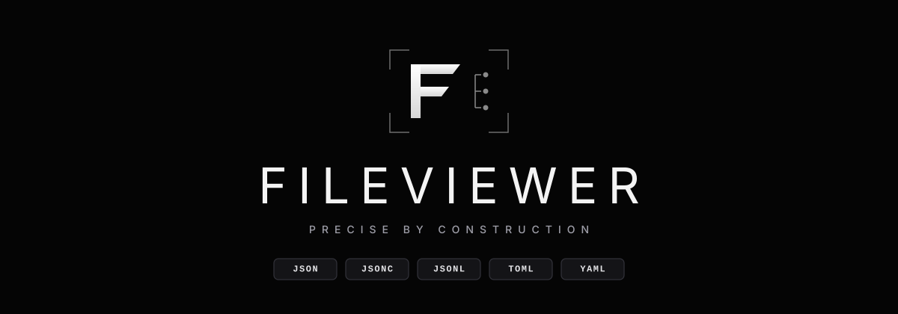

<p align="center">
  
</p>

<p align="center">
  <a href="https://github.com/IsmailAzzouz/FileViewer/releases"></a>
  
  
  
  <a href="LICENSE"></a>
</p>

<p align="center">
  <strong>High-performance, GPU-accelerated desktop viewer and editor for structured data.</strong><br>
  Built with Rust and GPUI. Handcrafted zero-dependency parsers with exact source spans, bidirectional AST tree navigation, diagnostics, and instant formatting.
</p>

<p align="center">
  <a href="#supported-formats">Supported Formats</a> •
  <a href="#key-features">Key Features</a> •
  <a href="#keyboard-shortcuts">Shortcuts</a> •
  <a href="#installation">Installation</a> •
  <a href="#getting-started">Getting Started</a> •
  <a href="#architecture--technical-design">Architecture</a>
</p>

---

## Supported Formats

FileViewer automatically identifies the document format from the file extension (with seamless fallback to JSON for unrecognized extensions).

| Format | Extensions | AST & Tree View | Format / Minify | Syntax Highlighting | Comments & Roundtrip |
| :--- | :--- | :---: | :---: | :---: | :--- |
| **JSON** | `.json` | Yes | Yes | Yes | Strict RFC 8259 parser with exact source byte spans |
| **JSONC** | `.jsonc` | Yes | Yes | Yes | Accepts `//` and `/* */` comments, trailing commas preserved |
| **JSONL** | `.jsonl`, `.ndjson` | Yes | Yes | Yes | Line-oriented stream parsed into synthetic root array |
| **TOML** | `.toml` | Yes | Yes | Yes | Tables, inline tables, dotted keys, multiline CRLF & LF |
| **YAML** | `.yaml`, `.yml` | Yes | Yes | Yes | Block/flow collections, multiline folded/literal scalars, anchors & aliases |

### Format Highlights

- **JSON & JSONC**: Accepts `//` and `/* */` comments and allows trailing commas in JSONC mode. Formatting and minification are line-oriented and never reserialize the AST, guaranteeing comments and blank lines survive intact.
- **JSONL / NDJSON**: Parsed as an ordered sequence of records, rendered in the tree view as a synthetic root array. UTF-8 BOMs are automatically stripped, and source spans are offset by the BOM length so cursor sync lands exactly on target.
- **TOML**: Robust support for standard key-value pairs, dotted keys, inline tables, table arrays (`[[table]]`), and multiline strings across both LF and Windows CRLF line endings.
- **YAML**: Covers block mappings, block sequences, flow collections, plain and quoted scalars (single and double-quoted with escape folding), block scalars with chomping and explicit indent indicators, anchors, aliases, and merge keys. Alias expansion is protected by a strict node budget to prevent expansion bombs without exhausting memory.

> [!TIP]
> Check [`samples/feature-tour.yml`](samples/feature-tour.yml) for a comprehensive demonstration of YAML constructs, anchors, folded scalars, and tree synchronization.

---

## Key Features

- **GPU-Accelerated Rendering**: Built on [GPUI](https://github.com/zed-industries/zed) (the UI framework developed for the Zed editor), providing hardware-accelerated 120 FPS rendering and smooth scrolling.
- **Bidirectional Tree Navigation**: Two-way synchronization between the code editor and the structural AST tree view. Clicking any node in the tree highlights its precise span in the document; moving the cursor in the editor automatically tracks and focuses the corresponding tree node.
- **Handcrafted Parsers**: Zero external parsing crates for JSON, JSONC, JSONL, TOML, and YAML. Every token, bracket, and node records precise byte offsets and line/column positions.
- **Non-Destructive Formatting**: Pretty-printing and minification normalize indentation without losing comments or whitespace context.
- **Real-Time Validation Diagnostics**: Instant feedback on syntax errors with exact line and column locations, visual markers, and a jump-to-error shortcut.
- **Find, Replace & Symbol Search**: Full in-document search, symbol jumping (<kbd>Alt</kbd>+<kbd>Down</kbd> / <kbd>Alt</kbd>+<kbd>Up</kbd>), soft word wrap (<kbd>Alt</kbd>+<kbd>Z</kbd>), and unlimited undo/redo.
- **Native OS Integration**: Professional Windows installer with Explorer context menu ("Open with FileViewer"), default file associations, and portable releases for both Windows and Linux.

---

## Keyboard Shortcuts

| Shortcut | Action |
| :--- | :--- |
| <kbd>Ctrl</kbd> + <kbd>O</kbd> | Open file |
| <kbd>Ctrl</kbd> + <kbd>S</kbd> | Save document |
| <kbd>Ctrl</kbd> + <kbd>Shift</kbd> + <kbd>F</kbd> | Format document |
| <kbd>Ctrl</kbd> + <kbd>F</kbd> | Find in document |
| <kbd>Ctrl</kbd> + <kbd>Z</kbd> / <kbd>Ctrl</kbd> + <kbd>Y</kbd> | Undo / Redo |
| <kbd>Ctrl</kbd> + <kbd>T</kbd> | Toggle tree panel |
| <kbd>Ctrl</kbd> + <kbd>Shift</kbd> + <kbd>E</kbd> | Expand all tree nodes |
| <kbd>Ctrl</kbd> + <kbd>Shift</kbd> + <kbd>C</kbd> | Collapse all tree nodes |
| <kbd>Alt</kbd> + <kbd>Z</kbd> | Toggle word wrap |
| <kbd>Alt</kbd> + <kbd>Down</kbd> / <kbd>Alt</kbd> + <kbd>Up</kbd> | Jump to next / previous symbol |

---

## Installation

Download prebuilt binaries directly from the **[Releases](https://github.com/IsmailAzzouz/FileViewer/releases)** page.

### Windows

- **Installer (`FileViewer-Setup-0.1.0.exe`)**:
  - Automatically installs FileViewer to `AppData\Local\Programs\FileViewer`.
  - Configures optional Desktop and Start Menu shortcuts.
  - Registers the Windows Explorer right-click context menu: **"Open with FileViewer"** for all supported formats and generic files.
  - Optionally associates `.json`, `.jsonc`, `.jsonl`, `.ndjson`, `.toml`, `.yaml`, and `.yml` files to open with FileViewer by default.
  - Clean uninstaller via Windows *Add or remove programs*.
- **Portable (`FileViewer-0.1.0-windows-x86_64.zip`)**:
  - Standalone executable requiring no installation or admin rights.
  - Embedded high-resolution multi-size Windows PE icon resources.

### Linux

- **Debian Package (`.deb`)**:
  ```bash
  sudo apt install ./file-viewer_0.1.0_amd64.deb
  ```
- **Portable Bundle (`.tar.xz`)**:
  ```bash
  tar -xf file-viewer_0.1.0_linux-x86_64.tar.xz
  cd bundle
  ./install.sh                 # use --prefix DIR to choose custom directory
  file-viewer config.toml
  ```
  Run `./uninstall.sh` to remove cleanly.

- **Integrity Verification**:
  ```bash
  sha256sum -c SHA256SUMS
  ```

### macOS

Prebuilt macOS binaries will be available in future releases. To build from source on macOS:
```bash
cargo build --release
```

---

## Getting Started

### Opening a File

Launch FileViewer directly with a path argument or press <kbd>Ctrl</kbd>+<kbd>O</kbd> from inside the application:

```bash
file-viewer path/to/document.yaml
```

### Building from Source

#### Prerequisites
- Rust 1.76+ (`rustup update`)
- On Linux, GPUI link-time libraries:
  ```bash
  sudo apt install libxcb1-dev libxkbcommon-dev libxkbcommon-x11-dev
  ```

#### Build & Run
```bash
# Debug build & run
cargo run -- config.jsonc

# Release build
cargo build --release
```

---

## Building Release Artifacts

### Windows Installer & Portable ZIP

```powershell
powershell -ExecutionPolicy Bypass -File scripts\build-installer.ps1
```

Generates:
- `dist/FileViewer-Setup-0.1.0.exe` (Inno Setup installer)
- `dist/FileViewer-0.1.0-windows-x86_64.zip` (Portable ZIP)
- `dist/SHA256SUMS`

### Linux Packages

```bash
packaging/linux/build_release.sh
```

Generates:
- `dist/file-viewer_0.1.0_amd64.deb`
- `dist/file-viewer_0.1.0_linux-x86_64.tar.xz`
- `dist/SHA256SUMS`

---

## Architecture & Technical Design

- **Zero-Bloat Custom Parsers**: Hand-written lexers and parsers designed specifically for precise byte-span tracking ($O(n)$ single-pass scanning). Unlike standard deserializers, FileViewer retains document structure, trivia, and exact coordinates.
- **Line & Byte Span Synchronization**: The editor maps visual screen lines and cursor offsets to AST node paths in $O(\log n)$ to $O(n)$ time, ensuring instant selection feedback without frame drops.
- **Memory Safety & Expansion Budgets**: Parsers enforce recursion depth bounds (default 128) and node expansion limits to prevent billion-laughs or deeply nested stack overflows.

---

## Testing

The project maintains a comprehensive test suite covering all parser dialects, round-tripping, syntax folding, BOM handling, and bidirectional synchronization:

```bash
cargo test
```

---

## License

This project is licensed under the [MIT License](LICENSE).